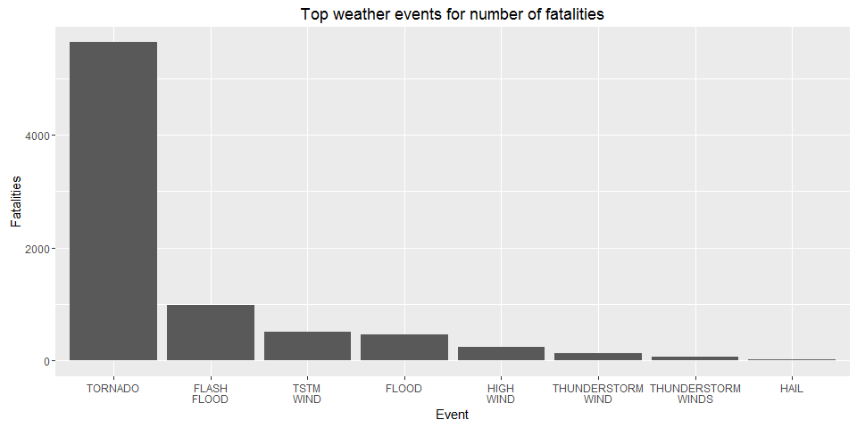
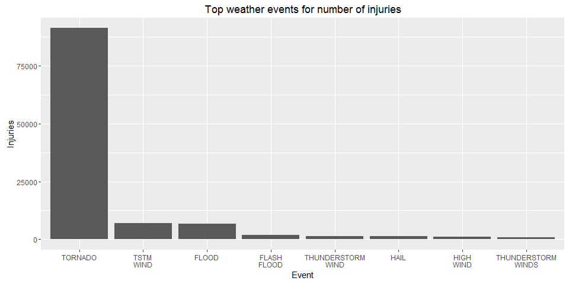
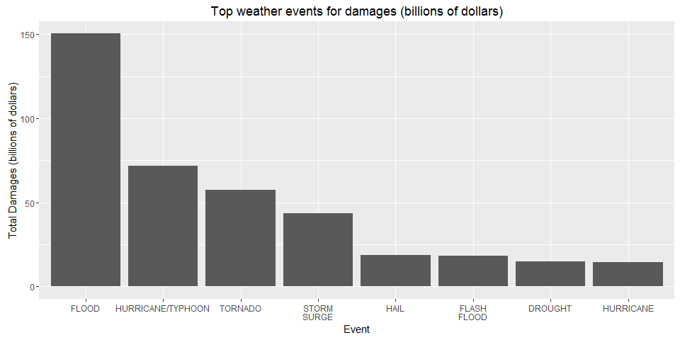

# Impact of weather events on public health and economy in the United States
Massimiliano Figini  
06 luglio 2016  

Storms and other severe weather events can cause both public health and economic problems for communities and municipalities. Many severe events can result in fatalities, injuries, and property damage, and preventing such outcomes to the extent possible is a key concern.  
This project involves exploring the U.S. National Oceanic and Atmospheric Administration's (NOAA) storm database. This database tracks characteristics of major storms and weather events in the United States, including when and where they occur, as well as estimates of any fatalities, injuries, and property damage.  
The events in the database start in the year 1950 and end in November 2011.  
The analysis in this document try to respond with tables and graphs at two questions:  
1. Across the United States, which types of events are most harmful with respect to population health?  
2. Across the United States, which types of events have the greatest economic consequences?  


<br>

###1. Data Processing  

The data for the assignment can be downloaded [here](https://d396qusza40orc.cloudfront.net/repdata%2Fdata%2FStormData.csv.bz2).  

**1.1 Settings**  
Load data and required libraries.  

```r
storm <- read.csv("repdata%2Fdata%2FStormData.csv")
library(dplyr)
stormDP <- tbl_df(storm)
library(ggplot2)
library(xtable)
```

<br>

**1.2 Table summary for find the most harmful events with respect to population health.**  
Injuries and fatalities are the variables considerated for this part of the analysis. Tables with summaries are created with this new variables for each event: Num (total number), Fatalities, Injuries, FatalitiesAVG (average number of fatalities), InjuriesAVG, PercWithFatalities (percentage of events with at least one dead) PercWithInjuries (percentage of events with at least one injury).

```r
# table with total injuries and fatalities for event
StormSummary <- stormDP %>% group_by(EVTYPE) %>% summarize(Num=n(),Fatalities=sum(FATALITIES),Fatalities_AVG=round(mean(FATALITIES),2),Injuries=sum(INJURIES),Injuries_AVG=round(mean(INJURIES),2))
# tables with events with at least one injury / death
WithInjuriesTB <- stormDP %>% filter(INJURIES>0) %>% group_by(EVTYPE) %>% summarize(WithInjuries=n())
WithDeadsTB <- stormDP %>% filter(FATALITIES>0) %>% group_by(EVTYPE) %>% summarize(WithDeads=n())
# join with summary table
StormSummary <- left_join(StormSummary,WithInjuriesTB, by="EVTYPE")
StormSummary <- left_join(StormSummary,WithDeadsTB, by="EVTYPE")
# percentage with at least one injury / fatality
StormSummary <- mutate(StormSummary, Perc_with_Injuries=round(WithInjuries/Num*100,2))
StormSummary <- mutate(StormSummary, Perc_with_Fatalities=round(WithDeads/Num*100,2))
# final summary table for the analysis
StormSummary2 <- StormSummary %>% select(EVTYPE,Num,Fatalities,Fatalities_AVG,Perc_with_Fatalities,Injuries,Injuries_AVG,Perc_with_Injuries) %>% arrange(desc(Num))
```

<br>

**1.3 Table summary for find the events that have the greatest economic consequences.**  
Property and crop damage exponents for each level is listed out and assigned those values for the property exponent data. Invalid data was excluded. Property damage value was calculated by multiplying the property damage and property exponent value. Total damages are the final variable that sum property and crop damages.

```r
# values of PROPDMGEXP
unique(stormDP$PROPDMGEXP)
```

```
##  [1] K M   B m + 0 5 6 ? 4 2 3 h 7 H - 1 8
## Levels:  - ? + 0 1 2 3 4 5 6 7 8 B h H K m M
```

```r
# traduction of PROPDMGEXP
stormDP$PropExpN <- 0
stormDP$PropExpN[stormDP$PROPDMGEXP == ""] <- 1
stormDP$PropExpN[stormDP$PROPDMGEXP == "-"] <- 0
stormDP$PropExpN[stormDP$PROPDMGEXP == "?"] <- 0
stormDP$PropExpN[stormDP$PROPDMGEXP == "+"] <- 0
stormDP$PropExpN[stormDP$PROPDMGEXP == "0"] <- 1
stormDP$PropExpN[stormDP$PROPDMGEXP == "1"] <- 10
stormDP$PropExpN[stormDP$PROPDMGEXP == "2"] <- 100
stormDP$PropExpN[stormDP$PROPDMGEXP == "3"] <- 1000
stormDP$PropExpN[stormDP$PROPDMGEXP == "4"] <- 10000
stormDP$PropExpN[stormDP$PROPDMGEXP == "5"] <- 100000
stormDP$PropExpN[stormDP$PROPDMGEXP == "6"] <- 1000000
stormDP$PropExpN[stormDP$PROPDMGEXP == "7"] <- 10000000
stormDP$PropExpN[stormDP$PROPDMGEXP == "8"] <- 100000000
stormDP$PropExpN[stormDP$PROPDMGEXP == "B"] <- 1000000000
stormDP$PropExpN[stormDP$PROPDMGEXP == "h"] <- 100
stormDP$PropExpN[stormDP$PROPDMGEXP == "H"] <- 100
stormDP$PropExpN[stormDP$PROPDMGEXP == "K"] <- 1000
stormDP$PropExpN[stormDP$PROPDMGEXP == "m"] <- 1000000
stormDP$PropExpN[stormDP$PROPDMGEXP == "M"] <- 1000000
# Final value for property damages
stormDP$PropDMGN <- stormDP$PROPDMG*stormDP$PropExpN
# values of CROPDMGEXP
unique(stormDP$CROPDMGEXP)
```

```
## [1]   M K m B ? 0 k 2
## Levels:  ? 0 2 B k K m M
```

```r
# traduction of CROPDMGEXP
stormDP$CropExpN <- 0
stormDP$CropExpN[stormDP$CROPDMGEXP == ""] <- 1
stormDP$CropExpN[stormDP$CROPDMGEXP == "?"] <- 0
stormDP$CropExpN[stormDP$CROPDMGEXP == "0"] <- 1
stormDP$CropExpN[stormDP$CROPDMGEXP == "2"] <- 100
stormDP$CropExpN[stormDP$CROPDMGEXP == "B"] <- 1000000000
stormDP$CropExpN[stormDP$CROPDMGEXP == "k"] <- 1000
stormDP$CropExpN[stormDP$CROPDMGEXP == "K"] <- 1000
stormDP$CropExpN[stormDP$CROPDMGEXP == "m"] <- 1000000
stormDP$CropExpN[stormDP$CROPDMGEXP == "M"] <- 1000000
# Final value for crop damages
stormDP$CropDMGN <- stormDP$CROPDMG*stormDP$CropExpN
# summary table for this analysis
StormSummary3 <- stormDP %>% group_by(EVTYPE) %>% summarize(PropDam=round(sum(PropDMGN),2),PropDam_AVG=round(mean(PropDMGN),2),CropDam=sum(CropDMGN),CropDam_AVG=round(mean(CropDMGN),2), TotalDamages = round(sum(PropDMGN)+sum(CropDMGN),2), TotalDamages_AVG = round(mean(sum(PropDMGN)+sum(CropDMGN)),2)) %>% arrange(desc(TotalDamages))
```

<br>
<br>

###2. Results  

**2.1 The most harmful events with respect to population health.**  
The table and the graph below show the events with the large number of fatalities.

```r
# top 20 for fatalities
print(xtable(as.data.frame(StormSummary2 %>% arrange(desc(Fatalities)))[1:20, ], auto = TRUE, caption='Top 20 events for number of fatalities'),type='html')
```

<!-- html table generated in R 3.2.5 by xtable 1.8-2 package -->
<!-- Tue Jul 26 20:50:33 2016 -->
<table border=1>
<caption align="bottom"> Top 20 events for number of fatalities </caption>
<tr> <th>  </th> <th> EVTYPE </th> <th> Num </th> <th> Fatalities </th> <th> Fatalities_AVG </th> <th> Perc_with_Fatalities </th> <th> Injuries </th> <th> Injuries_AVG </th> <th> Perc_with_Injuries </th>  </tr>
  <tr> <td> 1 </td> <td> TORNADO </td> <td align="right"> 60652 </td> <td align="right"> 5633 </td> <td align="right"> 0.09 </td> <td align="right"> 2.64 </td> <td align="right"> 91346 </td> <td align="right"> 1.51 </td> <td align="right"> 12.70 </td> </tr>
  <tr> <td> 2 </td> <td> EXCESSIVE HEAT </td> <td align="right"> 1678 </td> <td align="right"> 1903 </td> <td align="right"> 1.13 </td> <td align="right"> 34.39 </td> <td align="right"> 6525 </td> <td align="right"> 3.89 </td> <td align="right"> 9.83 </td> </tr>
  <tr> <td> 3 </td> <td> FLASH FLOOD </td> <td align="right"> 54277 </td> <td align="right"> 978 </td> <td align="right"> 0.02 </td> <td align="right"> 1.17 </td> <td align="right"> 1777 </td> <td align="right"> 0.03 </td> <td align="right"> 0.70 </td> </tr>
  <tr> <td> 4 </td> <td> HEAT </td> <td align="right"> 767 </td> <td align="right"> 937 </td> <td align="right"> 1.22 </td> <td align="right"> 23.21 </td> <td align="right"> 2100 </td> <td align="right"> 2.74 </td> <td align="right"> 6.00 </td> </tr>
  <tr> <td> 5 </td> <td> LIGHTNING </td> <td align="right"> 15754 </td> <td align="right"> 816 </td> <td align="right"> 0.05 </td> <td align="right"> 4.82 </td> <td align="right"> 5230 </td> <td align="right"> 0.33 </td> <td align="right"> 17.83 </td> </tr>
  <tr> <td> 6 </td> <td> TSTM WIND </td> <td align="right"> 219940 </td> <td align="right"> 504 </td> <td align="right"> 0.00 </td> <td align="right"> 0.18 </td> <td align="right"> 6957 </td> <td align="right"> 0.03 </td> <td align="right"> 1.21 </td> </tr>
  <tr> <td> 7 </td> <td> FLOOD </td> <td align="right"> 25326 </td> <td align="right"> 470 </td> <td align="right"> 0.02 </td> <td align="right"> 1.18 </td> <td align="right"> 6789 </td> <td align="right"> 0.27 </td> <td align="right"> 0.61 </td> </tr>
  <tr> <td> 8 </td> <td> RIP CURRENT </td> <td align="right"> 470 </td> <td align="right"> 368 </td> <td align="right"> 0.78 </td> <td align="right"> 69.57 </td> <td align="right"> 232 </td> <td align="right"> 0.49 </td> <td align="right"> 25.32 </td> </tr>
  <tr> <td> 9 </td> <td> HIGH WIND </td> <td align="right"> 20212 </td> <td align="right"> 248 </td> <td align="right"> 0.01 </td> <td align="right"> 0.91 </td> <td align="right"> 1137 </td> <td align="right"> 0.06 </td> <td align="right"> 2.03 </td> </tr>
  <tr> <td> 10 </td> <td> AVALANCHE </td> <td align="right"> 386 </td> <td align="right"> 224 </td> <td align="right"> 0.58 </td> <td align="right"> 45.08 </td> <td align="right"> 170 </td> <td align="right"> 0.44 </td> <td align="right"> 27.72 </td> </tr>
  <tr> <td> 11 </td> <td> WINTER STORM </td> <td align="right"> 11433 </td> <td align="right"> 206 </td> <td align="right"> 0.02 </td> <td align="right"> 1.11 </td> <td align="right"> 1321 </td> <td align="right"> 0.12 </td> <td align="right"> 1.33 </td> </tr>
  <tr> <td> 12 </td> <td> RIP CURRENTS </td> <td align="right"> 304 </td> <td align="right"> 204 </td> <td align="right"> 0.67 </td> <td align="right"> 59.54 </td> <td align="right"> 297 </td> <td align="right"> 0.98 </td> <td align="right"> 28.29 </td> </tr>
  <tr> <td> 13 </td> <td> HEAT WAVE </td> <td align="right"> 74 </td> <td align="right"> 172 </td> <td align="right"> 2.32 </td> <td align="right"> 35.14 </td> <td align="right"> 309 </td> <td align="right"> 4.18 </td> <td align="right"> 12.16 </td> </tr>
  <tr> <td> 14 </td> <td> EXTREME COLD </td> <td align="right"> 655 </td> <td align="right"> 160 </td> <td align="right"> 0.24 </td> <td align="right"> 16.49 </td> <td align="right"> 231 </td> <td align="right"> 0.35 </td> <td align="right"> 2.29 </td> </tr>
  <tr> <td> 15 </td> <td> THUNDERSTORM WIND </td> <td align="right"> 82563 </td> <td align="right"> 133 </td> <td align="right"> 0.00 </td> <td align="right"> 0.13 </td> <td align="right"> 1488 </td> <td align="right"> 0.02 </td> <td align="right"> 0.74 </td> </tr>
  <tr> <td> 16 </td> <td> HEAVY SNOW </td> <td align="right"> 15708 </td> <td align="right"> 127 </td> <td align="right"> 0.01 </td> <td align="right"> 0.58 </td> <td align="right"> 1021 </td> <td align="right"> 0.06 </td> <td align="right"> 0.83 </td> </tr>
  <tr> <td> 17 </td> <td> EXTREME COLD/WIND CHILL </td> <td align="right"> 1002 </td> <td align="right"> 125 </td> <td align="right"> 0.12 </td> <td align="right"> 8.68 </td> <td align="right"> 24 </td> <td align="right"> 0.02 </td> <td align="right"> 0.90 </td> </tr>
  <tr> <td> 18 </td> <td> STRONG WIND </td> <td align="right"> 3566 </td> <td align="right"> 103 </td> <td align="right"> 0.03 </td> <td align="right"> 2.52 </td> <td align="right"> 280 </td> <td align="right"> 0.08 </td> <td align="right"> 4.18 </td> </tr>
  <tr> <td> 19 </td> <td> BLIZZARD </td> <td align="right"> 2719 </td> <td align="right"> 101 </td> <td align="right"> 0.04 </td> <td align="right"> 2.21 </td> <td align="right"> 805 </td> <td align="right"> 0.30 </td> <td align="right"> 1.77 </td> </tr>
  <tr> <td> 20 </td> <td> HIGH SURF </td> <td align="right"> 725 </td> <td align="right"> 101 </td> <td align="right"> 0.14 </td> <td align="right"> 9.24 </td> <td align="right"> 152 </td> <td align="right"> 0.21 </td> <td align="right"> 5.10 </td> </tr>
   </table>

```r
# modification for the graph label
levels(StormSummary2$EVTYPE) <- gsub(" ", "\n",levels(StormSummary2$EVTYPE))
# desc order for the first graph
StormSummary2$EVTYPE <- factor(StormSummary2$EVTYPE, levels = StormSummary2$EVTYPE[order(StormSummary2$Fatalities, decreasing=TRUE)])
# graph with fatalities per event
g <- ggplot(head(as.data.frame(StormSummary2),n=8), aes(EVTYPE, Fatalities))
g+geom_bar(stat='identity')+labs(title="Top weather events for number of fatalities", x="Event",y="Fatalities")
```

<!-- -->

<br>

The table and the graph below show the events with the large number of injuries.

```r
# top 20 for injuries
print(xtable(as.data.frame(StormSummary2 %>% arrange(desc(Injuries)))[1:20, ], auto = TRUE, caption='Top 20 events for number of injuries'),type='html')
```

<!-- html table generated in R 3.2.5 by xtable 1.8-2 package -->
<!-- Tue Jul 26 20:50:34 2016 -->
<table border=1>
<caption align="bottom"> Top 20 events for number of injuries </caption>
<tr> <th>  </th> <th> EVTYPE </th> <th> Num </th> <th> Fatalities </th> <th> Fatalities_AVG </th> <th> Perc_with_Fatalities </th> <th> Injuries </th> <th> Injuries_AVG </th> <th> Perc_with_Injuries </th>  </tr>
  <tr> <td> 1 </td> <td> TORNADO </td> <td align="right"> 60652 </td> <td align="right"> 5633 </td> <td align="right"> 0.09 </td> <td align="right"> 2.64 </td> <td align="right"> 91346 </td> <td align="right"> 1.51 </td> <td align="right"> 12.70 </td> </tr>
  <tr> <td> 2 </td> <td> TSTM
WIND </td> <td align="right"> 219940 </td> <td align="right"> 504 </td> <td align="right"> 0.00 </td> <td align="right"> 0.18 </td> <td align="right"> 6957 </td> <td align="right"> 0.03 </td> <td align="right"> 1.21 </td> </tr>
  <tr> <td> 3 </td> <td> FLOOD </td> <td align="right"> 25326 </td> <td align="right"> 470 </td> <td align="right"> 0.02 </td> <td align="right"> 1.18 </td> <td align="right"> 6789 </td> <td align="right"> 0.27 </td> <td align="right"> 0.61 </td> </tr>
  <tr> <td> 4 </td> <td> EXCESSIVE
HEAT </td> <td align="right"> 1678 </td> <td align="right"> 1903 </td> <td align="right"> 1.13 </td> <td align="right"> 34.39 </td> <td align="right"> 6525 </td> <td align="right"> 3.89 </td> <td align="right"> 9.83 </td> </tr>
  <tr> <td> 5 </td> <td> LIGHTNING </td> <td align="right"> 15754 </td> <td align="right"> 816 </td> <td align="right"> 0.05 </td> <td align="right"> 4.82 </td> <td align="right"> 5230 </td> <td align="right"> 0.33 </td> <td align="right"> 17.83 </td> </tr>
  <tr> <td> 6 </td> <td> HEAT </td> <td align="right"> 767 </td> <td align="right"> 937 </td> <td align="right"> 1.22 </td> <td align="right"> 23.21 </td> <td align="right"> 2100 </td> <td align="right"> 2.74 </td> <td align="right"> 6.00 </td> </tr>
  <tr> <td> 7 </td> <td> ICE
STORM </td> <td align="right"> 2006 </td> <td align="right"> 89 </td> <td align="right"> 0.04 </td> <td align="right"> 2.84 </td> <td align="right"> 1975 </td> <td align="right"> 0.98 </td> <td align="right"> 3.09 </td> </tr>
  <tr> <td> 8 </td> <td> FLASH
FLOOD </td> <td align="right"> 54277 </td> <td align="right"> 978 </td> <td align="right"> 0.02 </td> <td align="right"> 1.17 </td> <td align="right"> 1777 </td> <td align="right"> 0.03 </td> <td align="right"> 0.70 </td> </tr>
  <tr> <td> 9 </td> <td> THUNDERSTORM
WIND </td> <td align="right"> 82563 </td> <td align="right"> 133 </td> <td align="right"> 0.00 </td> <td align="right"> 0.13 </td> <td align="right"> 1488 </td> <td align="right"> 0.02 </td> <td align="right"> 0.74 </td> </tr>
  <tr> <td> 10 </td> <td> HAIL </td> <td align="right"> 288661 </td> <td align="right"> 15 </td> <td align="right"> 0.00 </td> <td align="right"> 0.00 </td> <td align="right"> 1361 </td> <td align="right"> 0.00 </td> <td align="right"> 0.10 </td> </tr>
  <tr> <td> 11 </td> <td> WINTER
STORM </td> <td align="right"> 11433 </td> <td align="right"> 206 </td> <td align="right"> 0.02 </td> <td align="right"> 1.11 </td> <td align="right"> 1321 </td> <td align="right"> 0.12 </td> <td align="right"> 1.33 </td> </tr>
  <tr> <td> 12 </td> <td> HURRICANE/TYPHOON </td> <td align="right"> 88 </td> <td align="right"> 64 </td> <td align="right"> 0.73 </td> <td align="right"> 21.59 </td> <td align="right"> 1275 </td> <td align="right"> 14.49 </td> <td align="right"> 13.64 </td> </tr>
  <tr> <td> 13 </td> <td> HIGH
WIND </td> <td align="right"> 20212 </td> <td align="right"> 248 </td> <td align="right"> 0.01 </td> <td align="right"> 0.91 </td> <td align="right"> 1137 </td> <td align="right"> 0.06 </td> <td align="right"> 2.03 </td> </tr>
  <tr> <td> 14 </td> <td> HEAVY
SNOW </td> <td align="right"> 15708 </td> <td align="right"> 127 </td> <td align="right"> 0.01 </td> <td align="right"> 0.58 </td> <td align="right"> 1021 </td> <td align="right"> 0.06 </td> <td align="right"> 0.83 </td> </tr>
  <tr> <td> 15 </td> <td> WILDFIRE </td> <td align="right"> 2761 </td> <td align="right"> 75 </td> <td align="right"> 0.03 </td> <td align="right"> 1.01 </td> <td align="right"> 911 </td> <td align="right"> 0.33 </td> <td align="right"> 6.66 </td> </tr>
  <tr> <td> 16 </td> <td> THUNDERSTORM
WINDS </td> <td align="right"> 20843 </td> <td align="right"> 64 </td> <td align="right"> 0.00 </td> <td align="right"> 0.24 </td> <td align="right"> 908 </td> <td align="right"> 0.04 </td> <td align="right"> 1.55 </td> </tr>
  <tr> <td> 17 </td> <td> BLIZZARD </td> <td align="right"> 2719 </td> <td align="right"> 101 </td> <td align="right"> 0.04 </td> <td align="right"> 2.21 </td> <td align="right"> 805 </td> <td align="right"> 0.30 </td> <td align="right"> 1.77 </td> </tr>
  <tr> <td> 18 </td> <td> FOG </td> <td align="right"> 538 </td> <td align="right"> 62 </td> <td align="right"> 0.12 </td> <td align="right"> 6.88 </td> <td align="right"> 734 </td> <td align="right"> 1.36 </td> <td align="right"> 14.50 </td> </tr>
  <tr> <td> 19 </td> <td> WILD/FOREST
FIRE </td> <td align="right"> 1457 </td> <td align="right"> 12 </td> <td align="right"> 0.01 </td> <td align="right"> 0.62 </td> <td align="right"> 545 </td> <td align="right"> 0.37 </td> <td align="right"> 8.92 </td> </tr>
  <tr> <td> 20 </td> <td> DUST
STORM </td> <td align="right"> 427 </td> <td align="right"> 22 </td> <td align="right"> 0.05 </td> <td align="right"> 2.11 </td> <td align="right"> 440 </td> <td align="right"> 1.03 </td> <td align="right"> 10.30 </td> </tr>
   </table>

```r
# desc order for the second graph
StormSummary2$EVTYPE <- factor(StormSummary2$EVTYPE, levels = StormSummary2$EVTYPE[order(StormSummary2$Injuries, decreasing=TRUE)])
# graph with injuries per event
g2 <- ggplot(head(as.data.frame(StormSummary2),n=8), aes(EVTYPE, Injuries))
g2+geom_bar(stat='identity')+labs(title="Top weather events for number of injuries", x="Event",y="Injuries")
```

<!-- -->

Based on the data, TORNADO caused the maximum number of fatalities and injuries, and for this reason it's the most harmful with respect to population health.


<br>

**2.2 The events that have the greatest economic consequences.**  


```r
# top 20 for damages
print(xtable(as.data.frame(StormSummary3)[1:20, ], digits=0, auto = TRUE, caption='Top 20 events for economic damages'),type='html')
```

```
## Warning in formatC(x = c(5661968450, 2607872800, 414953270, 5000,
## 3025954473, : NAs introduced by coercion to integer range
```

<!-- html table generated in R 3.2.5 by xtable 1.8-2 package -->
<!-- Tue Jul 26 20:50:34 2016 -->
<table border=1>
<caption align="bottom"> Top 20 events for economic damages </caption>
<tr> <th>  </th> <th> EVTYPE </th> <th> PropDam </th> <th> PropDam_AVG </th> <th> CropDam </th> <th> CropDam_AVG </th> <th> TotalDamages </th> <th> TotalDamages_AVG </th>  </tr>
  <tr> <td> 1 </td> <td> FLOOD </td> <td align="right"> 144657709807 </td> <td align="right"> 5711826 </td> <td align="right"> NA </td> <td align="right"> 223563 </td> <td align="right"> 150319678257 </td> <td align="right"> 150319678257 </td> </tr>
  <tr> <td> 2 </td> <td> HURRICANE/TYPHOON </td> <td align="right"> 69305840000 </td> <td align="right"> 787566364 </td> <td align="right"> NA </td> <td align="right"> 29634918 </td> <td align="right"> 71913712800 </td> <td align="right"> 71913712800 </td> </tr>
  <tr> <td> 3 </td> <td> TORNADO </td> <td align="right"> 56947380617 </td> <td align="right"> 938920 </td> <td align="right"> 414953270 </td> <td align="right"> 6842 </td> <td align="right"> 57362333887 </td> <td align="right"> 57362333887 </td> </tr>
  <tr> <td> 4 </td> <td> STORM SURGE </td> <td align="right"> 43323536000 </td> <td align="right"> 165990559 </td> <td align="right"> 5000 </td> <td align="right"> 19 </td> <td align="right"> 43323541000 </td> <td align="right"> 43323541000 </td> </tr>
  <tr> <td> 5 </td> <td> HAIL </td> <td align="right"> 15735267513 </td> <td align="right"> 54511 </td> <td align="right"> NA </td> <td align="right"> 10483 </td> <td align="right"> 18761221986 </td> <td align="right"> 18761221986 </td> </tr>
  <tr> <td> 6 </td> <td> FLASH FLOOD </td> <td align="right"> 16822673979 </td> <td align="right"> 309941 </td> <td align="right"> 1421317100 </td> <td align="right"> 26186 </td> <td align="right"> 18243991079 </td> <td align="right"> 18243991079 </td> </tr>
  <tr> <td> 7 </td> <td> DROUGHT </td> <td align="right"> 1046106000 </td> <td align="right"> 420461 </td> <td align="right"> NA </td> <td align="right"> 5615983 </td> <td align="right"> 15018672000 </td> <td align="right"> 15018672000 </td> </tr>
  <tr> <td> 8 </td> <td> HURRICANE </td> <td align="right"> 11868319010 </td> <td align="right"> 68208730 </td> <td align="right"> NA </td> <td align="right"> 15758103 </td> <td align="right"> 14610229010 </td> <td align="right"> 14610229010 </td> </tr>
  <tr> <td> 9 </td> <td> RIVER FLOOD </td> <td align="right"> 5118945500 </td> <td align="right"> 29589280 </td> <td align="right"> NA </td> <td align="right"> 29072017 </td> <td align="right"> 10148404500 </td> <td align="right"> 10148404500 </td> </tr>
  <tr> <td> 10 </td> <td> ICE STORM </td> <td align="right"> 3944927860 </td> <td align="right"> 1966564 </td> <td align="right"> NA </td> <td align="right"> 2503546 </td> <td align="right"> 8967041360 </td> <td align="right"> 8967041360 </td> </tr>
  <tr> <td> 11 </td> <td> TROPICAL STORM </td> <td align="right"> 7703890550 </td> <td align="right"> 11165059 </td> <td align="right"> 678346000 </td> <td align="right"> 983110 </td> <td align="right"> 8382236550 </td> <td align="right"> 8382236550 </td> </tr>
  <tr> <td> 12 </td> <td> WINTER STORM </td> <td align="right"> 6688497251 </td> <td align="right"> 585017 </td> <td align="right"> 26944000 </td> <td align="right"> 2357 </td> <td align="right"> 6715441251 </td> <td align="right"> 6715441251 </td> </tr>
  <tr> <td> 13 </td> <td> HIGH WIND </td> <td align="right"> 5270046260 </td> <td align="right"> 260738 </td> <td align="right"> 638571300 </td> <td align="right"> 31594 </td> <td align="right"> 5908617560 </td> <td align="right"> 5908617560 </td> </tr>
  <tr> <td> 14 </td> <td> WILDFIRE </td> <td align="right"> 4765114000 </td> <td align="right"> 1725865 </td> <td align="right"> 295472800 </td> <td align="right"> 107017 </td> <td align="right"> 5060586800 </td> <td align="right"> 5060586800 </td> </tr>
  <tr> <td> 15 </td> <td> TSTM WIND </td> <td align="right"> 4484928495 </td> <td align="right"> 20392 </td> <td align="right"> 554007350 </td> <td align="right"> 2519 </td> <td align="right"> 5038935845 </td> <td align="right"> 5038935845 </td> </tr>
  <tr> <td> 16 </td> <td> STORM SURGE/TIDE </td> <td align="right"> 4641188000 </td> <td align="right"> 31359378 </td> <td align="right"> 850000 </td> <td align="right"> 5743 </td> <td align="right"> 4642038000 </td> <td align="right"> 4642038000 </td> </tr>
  <tr> <td> 17 </td> <td> THUNDERSTORM WIND </td> <td align="right"> 3483122472 </td> <td align="right"> 42187 </td> <td align="right"> 414843050 </td> <td align="right"> 5025 </td> <td align="right"> 3897965522 </td> <td align="right"> 3897965522 </td> </tr>
  <tr> <td> 18 </td> <td> HURRICANE OPAL </td> <td align="right"> 3172846000 </td> <td align="right"> 352538444 </td> <td align="right"> 19000000 </td> <td align="right"> 2111111 </td> <td align="right"> 3191846000 </td> <td align="right"> 3191846000 </td> </tr>
  <tr> <td> 19 </td> <td> WILD/FOREST FIRE </td> <td align="right"> 3001829500 </td> <td align="right"> 2060281 </td> <td align="right"> 106796830 </td> <td align="right"> 73299 </td> <td align="right"> 3108626330 </td> <td align="right"> 3108626330 </td> </tr>
  <tr> <td> 20 </td> <td> HEAVY RAIN/SEVERE WEATHER </td> <td align="right"> 2500000000 </td> <td align="right"> 1250000000 </td> <td align="right"> 0 </td> <td align="right"> 0 </td> <td align="right"> 2500000000 </td> <td align="right"> 2500000000 </td> </tr>
   </table>

```r
# modification for the graph label
levels(StormSummary3$EVTYPE) <- gsub(" ", "\n",levels(StormSummary3$EVTYPE))
# desc order for the graph
StormSummary3$EVTYPE <- factor(StormSummary3$EVTYPE, levels = StormSummary3$EVTYPE[order(StormSummary3$TotalDamages, decreasing=TRUE)])
# graph with damages per event
h <- ggplot(head(as.data.frame(StormSummary3),n=8), aes(EVTYPE, TotalDamages/1000000000))
h+geom_bar(stat='identity')+labs(title="Top weather events for damages (billions of dollars)", x="Event",y="Total Damages (billions of dollars)")
```

<!-- -->

Based on the data, FLOOD have the greatest economic consequences.
